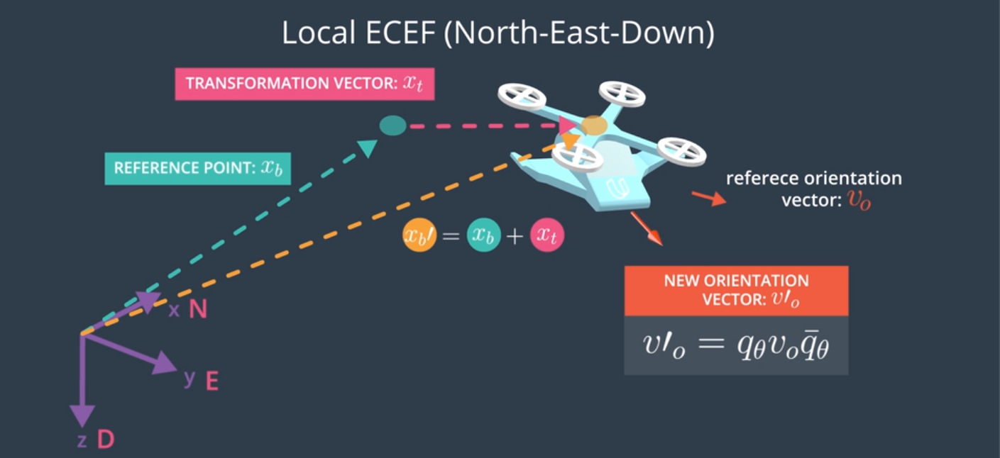
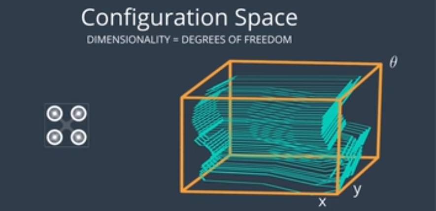
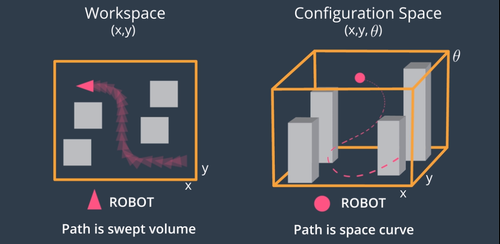

# AAE_Notebook_005_ConfigSpace
Now that we're able to represent the location of the vehicle as a reference point within a coordinate frame (in this case, the Local ECEF Frame) as well as its orientation, thanks to the Body Frame, we can consider motion of the vehicle as a transformation therein.

However, real robots and vehicles are not just reference points and vectors; they're 3-dimensional objects within a 3D World -- That is, they have a physical size. So, we must now start taking into account the physical size of the vehicle, as well as the location of obstacles within the environment.

In general, this configuration space will have a dimensionality of the degrees of freedom of your robot. In the case of our 2D quadrotor, we have two translational degrees of freedom and one rotational degree of freedom and, therefor, our configuration space will be 3-dimensional. 3D AAVs have 6 degrees of freedom -- 3 translational and 3 rotational. Thus, our configuration space will be 6-dimensional.

Within this configuration space, the robot becomes a single-point representation and the obstacles within the environment take on a more complex, multi-dimensional shapes. This makes our path-planning far less complex, even with a 3D robot within a 3D environment.

Here is a visualization of a 2D robot and its accompanying 3D configuration space:

Going into higher dimensions make things much more difficult to visualize; however, we're not actually going to compute these complex obstacle shapes explicitely, nor are we going to define a 6-dimensional configuration space in simulation. We're going to use a simplified, 3-dimensional configuration space and add a margin of infeasible space around each obstacle before planning.

### Additional Resources
The video linked below, from the Freie Universität Berlin, is a wonderful visualization of a 3D configuration space. The video starts off with a rather complicated configuration space (to show the end result), but then steps through how it is built. First, it will display different types of motion around one obstacle, and then describe how these motions map into the 3D configuration space, and finally introduce additional obstacles to create the final configuration space.

[Configuration Space Visualization](https://www.youtube.com/watch?v=SBFwgR4K1Gk)
